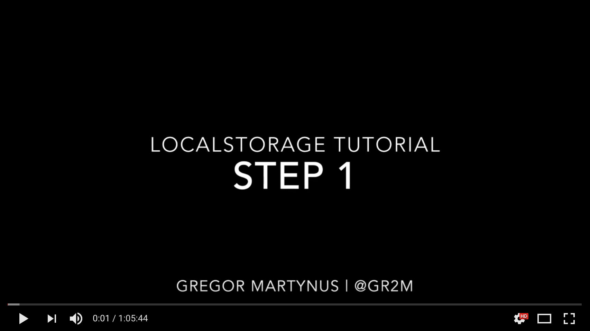

# localstorage-tutorial

> Build a simple HTML page that stores data in and renders data from localStorage

[](https://youtu.be/8jGDxNnx3HM)


This tutorial has 3 parts.

1. **No data storage**  
   Create an index.html file with a little bit of styling that shows a form to
   create a new contact, a table to show hardcoded contacts, and an edit form
   to edit existing contacts.
2. **Store data in localStorage**  
   Instead of showing hardcoded contacts, we store our contacts in localStorage
3. **contacts store API**  
   Instead of interacting with the `localStorage` API directly, we create a
   custom `contactsStore` API that abstracts away how contacts are stored.

I might add more steps or ideas for exercises in future.

## Work in Progress

- I’ve made a screencast of me coding step 1 & 2 and will upload it tomorrow
- For step 3, I suggest an API like this

  ```js
  contactsStore.add(contact).then(function (contact) {}).catch(function (error) {})
  contactsStore.findAll().then(function (contacts) {}).catch(function (error) {})
  contactsStore.update(contact).then(function (contact) {}).catch(function (error) {})
  contactsStore.remove(contact).then(function (contact) {}).catch(function (error) {})
  ```

  This API uses [Promises](https://developer.mozilla.org/en-US/docs/Web/JavaScript/Reference/Global_Objects/Promise). Here is a [short introduction](https://davidwalsh.name/promises). Note that [Promises can be tricky](https://pouchdb.com/2015/05/18/we-have-a-problem-with-promises.html).
